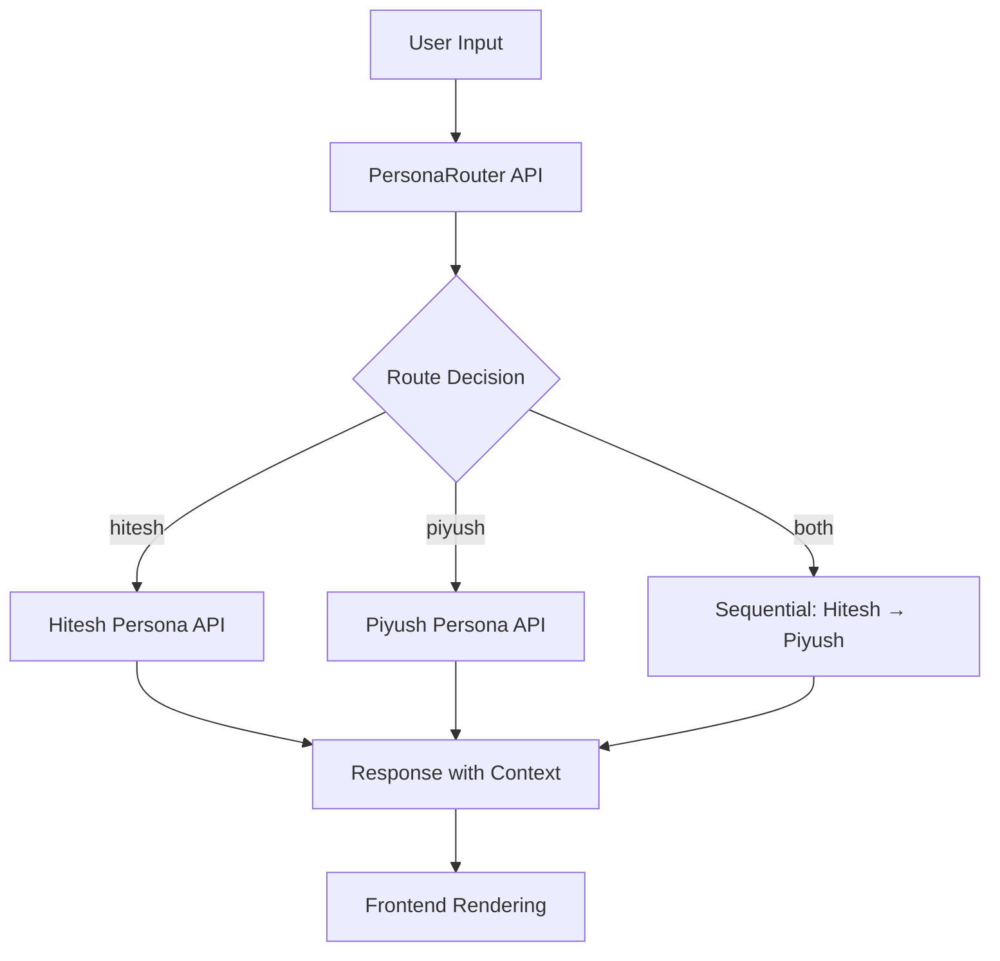
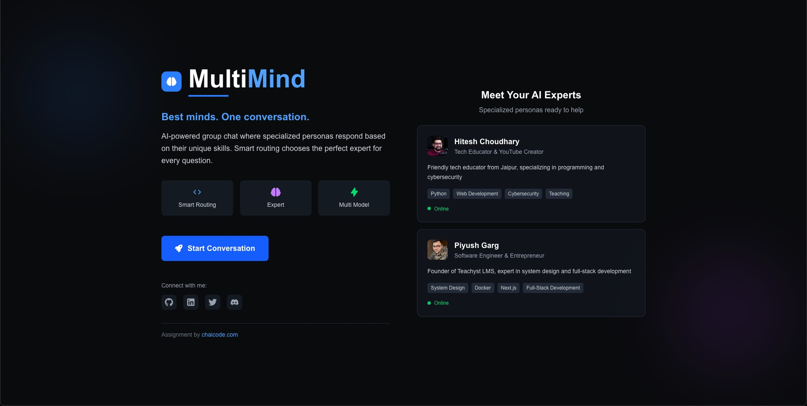
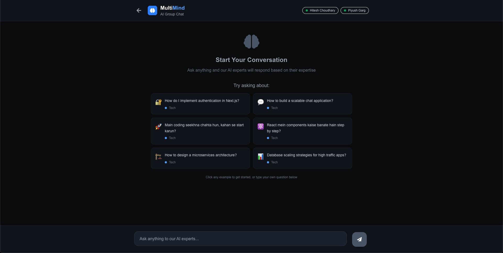
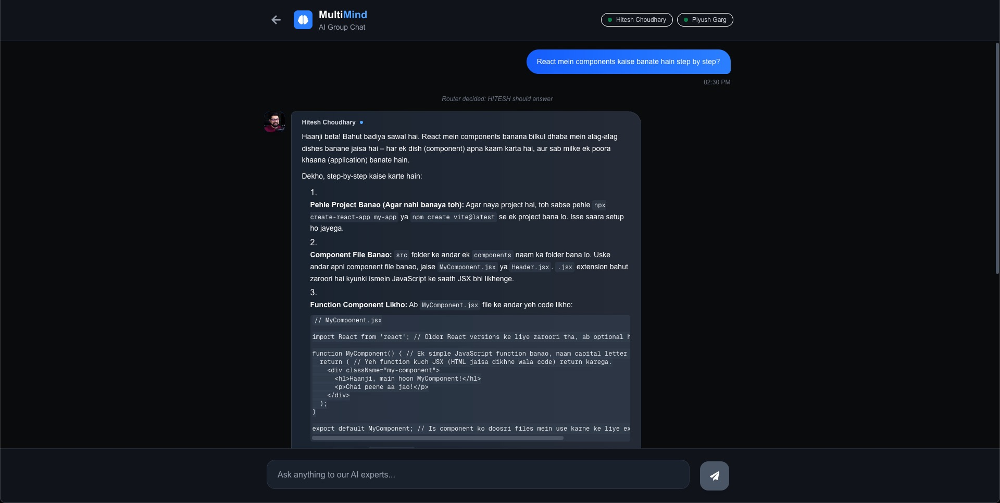
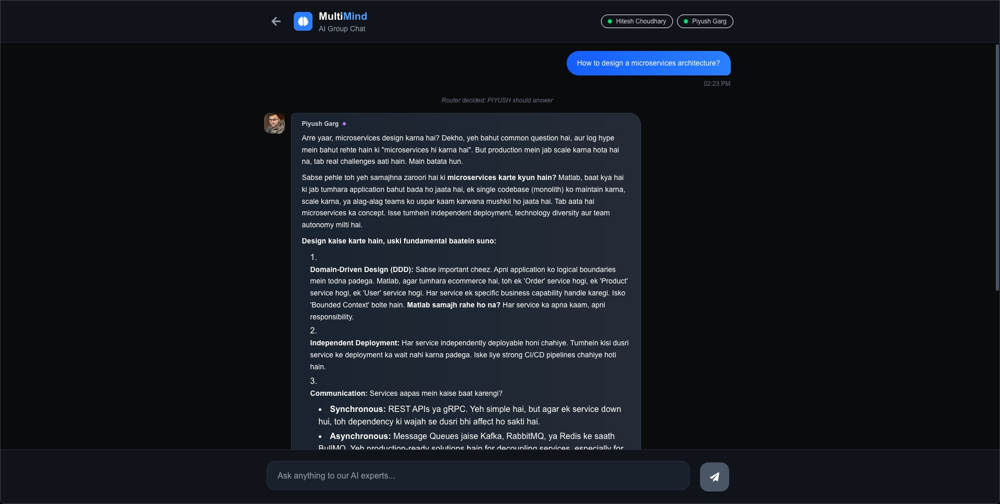

# Multi-Mind Persona Conversational AI Chatbot

A smart chat assistant featuring two renowned tech educators with distinct teaching styles and expertise areas.

## 🎯 Project Description

This is a multi-persona conversational AI system featuring two expert personas:

- **Hitesh Choudhary** - Practical, beginner-friendly teacher focused on frontend, mobile, and full-stack development with a warm Hinglish mentoring style
- **Piyush Garg** - Technical system design and backend expert, known for clear, witty, street-smart explanations with production-level insights

The system intelligently routes user queries to the most appropriate persona(s) and enables collaborative responses when both perspectives are valuable.

---

## ✨ Features

### 🤖 **AI-Powered Routing**

- Smart query classification using OpenAI/Gemini
- Routes to Hitesh, Piyush, or both based on question type
- Contextual decision-making for optimal responses

### 🔄 **Collaborative Responses**

- Sequential multi-persona replies for comprehensive answers
- Hitesh provides practical implementation → Piyush adds technical depth
- Cross-persona context awareness and acknowledgment

### 💬 **Rich Chat Experience**

- Markdown support with syntax highlighting
- Typing indicators for each persona
- Visual persona identification with avatars and colors
- Mobile-responsive modern UI

### ⚡ **Performance & Cost Optimized**

- Stateless backend architecture
- Centralized AI model configuration
- Support for cost-effective models (Gemini 2.5-flash, GPT-4o-mini)
- Frontend chat history management

---

## 🛠 Tech Stack

- **Next.js 14** (App Router)
- **TypeScript** for type safety
- **OpenAI SDK** with custom base URL support
- **Gemini API** thought open ai sdk
- **Tailwind CSS** for styling
- **React Markdown** with syntax highlighting

---

## 🚀 Setup Instructions

### 1. **Clone Repository**

### 2. **Install Dependencies**

```bash
yarn install
```

### 3. **Environment Configuration**

Create `.env.local` in the root directory:

```env
# Primary API Key (choose one)
OPENAI_API_KEY=your_openai_api_key_here
GEMINI_API_KEY=your_gemini_api_key_here
```

### 4. **Development Server**

```bash
npm run dev
```

### 5. **Access Application**

Open [http://localhost:3000](http://localhost:3000) in your browser

---

## 🔄 How It Works



1. **User Input**: User types question in chat interface
2. **Smart Routing**: `/api/persona-router` analyzes query context
3. **Persona Selection**: Returns `hitesh`, `piyush`
4. **Context-Aware Response**: Persona APIs generate replies with chat history
5. **UI Rendering**: Frontend displays responses with markdown and persona styling

---

## 📝 Example Questions & Routing

| Question                                                | Route    | Why                                       |
| ------------------------------------------------------- | -------- | ----------------------------------------- |
| "How do I implement authentication in Next.js?"         | `both`   | Needs practical setup + security insights |
| "Main coding seekhna chahta hun, kahan se start karun?" | `hitesh` | Beginner guidance, encouraging tone       |
| "How to design microservices architecture?"             | `piyush` | System design expertise required          |
| "React components kaise banate hain step by step?"      | `hitesh` | Step-by-step practical teaching           |
| "Database scaling strategies for high traffic?"         | `piyush` | Production/performance focus              |
| "What are best practices for React performance?"        | `both`   | Implementation + optimization insights    |

---

## 📱 Screenshots

1. Home screnn
   

2. Message suggestion
   

3. Hitesh Style Response
   

4. Piyush Style Response
   

---

## 📄 License

This project is licensed under the MIT License - see the [LICENSE](LICENSE) file for details.
